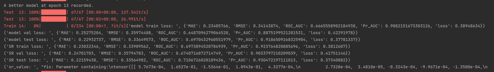

## Evolvable Psychology Informed Neural Network for Memory Behavior Modeling
.png)

### **Environment Configuration**
```
- Python 3.9 or higher
- PyTorch >= 1.13.1
- NumPy >= 1.22.4
- GPU: NVIDIA GTX 1080 Ti or higher
- RAM: 8 GB or more
```

### Run main.py
```cmd
python main.py
```

### model output


The performance test for the model component is represented by **model loss**. The performance test for sparse regression with differential operators is denoted as **SR loss**. The term **sr_value** refers to the coefficient of the differential operator in sparse regression.

